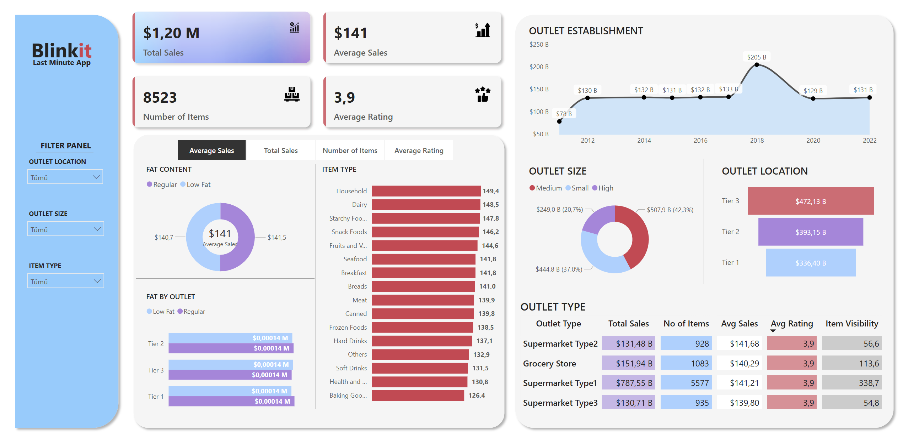

# blinkIt

# 🛒 Power BI Dashboard – Blinkit Sales Analysis

Welcome! This is an interactive **Power BI dashboard** project that analyzes sales data for a Blinkit-style grocery service. It offers rich visual insights and dynamic filtering features, perfect for understanding sales trends and outlet performance.

---

## 📊 Project Overview

🧹 **Cleaned and transformed raw data** using Power Query  
🧠 Built key performance indicators (**KPIs**) using **DAX**  
📈 Designed a clean, interactive dashboard to explore:

- 📦 Sales by **Item Type**, **Fat Content**, **Outlet Type**, and more  
- 🏬 Outlet performance by **Size** and **Establishment Year**  
- ⭐ **Average Ratings**, **Total Sales**, and **Item Count**  
- 🧭 Fully **interactive slicers** and **drill-throughs** for in-depth analysis

---

## 🧠 Features & KPIs

✅ **Key Performance Indicators (KPIs)**

- 💰 **Total Sales**  
- 📦 **Item Count**  
- 🧮 **Average Sale Value**  
- ⭐ **Average Rating**

📊 **Analytical Visuals**

- 📊 Bar Charts: Sales by Item Type & Fat Content  
- 🥧 Pie Charts: Fat Content & Outlet Sizes  
- 📍 Outlet-level insights by Type & Establishment Year  
- 📅 Time-based filters via slicers

🎛 **Interactive Elements**

- ✅ Slicers for Item Type, Outlet Type, Size, and Timeframes  
- 🔍 Drill-through capability for outlet or item-level deep dives

---

## 🛠️ Tech Stack

- 🧰 **Microsoft Power BI Desktop (.pbix)**  
- 🔄 **Power Query** – for data cleaning & transformation  
- 📐 **DAX (Data Analysis Expressions)** – for creating KPIs & measures  
- 🧾 Excel as base data source (can be extended to streaming sources)

---

## 🎯 Visuals & Interactions

- 📍 KPI Cards: top-level overview  
- 📊 Bar & Column Charts: for comparisons  
- 🥧 Pie Charts: for distribution insights  
- 🧭 Slicers: to segment and filter data easily  

---

## 🙌 Credits

Inspired by:  
🎥 [Amazing Real-Time Power BI Project – Start to End](https://www.youtube.com/watch?v=mmxVCFceQgU&list=LL&index=3&t=58s)

Developed with love by **Selin**
